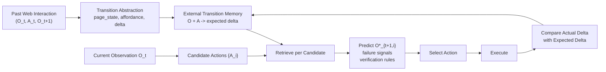

# Web Transition Memory Meeting Brief

작성일: 2026-04-29

## 0. 내일 미팅 목표

내일 미팅의 목표는 "완성된 실험 결과"를 보여주는 것이 아니라, 다음 세 가지를 합의받는 것이다.

1. 문제정의: 웹 에이전트는 `무엇을 해야 하는가`뿐 아니라 `그 행동을 하면 화면이 어떻게 바뀌는가`를 알아야 한다.
2. 방법 방향: world model을 파라미터에 굽는 대신, 실제 interaction에서 얻은 transition을 external memory로 저장하자.
3. 실험 방향: 같은 input에 대해 기존 방법들이 어떤 output을 내는지 비교하고, ours가 candidate-wise transition prediction을 더 잘 주는지 본다.

Baseline 후보와 citation/GitHub 여부는 `WEB_TRANSITION_BASELINE_CANDIDATES.md`에 따로 정리했다. 같은 예시에 대해 baseline별 저장 단위, inference input, output, 단계별 흐름은 `WEB_TRANSITION_BASELINE_IO_EXAMPLES.md`에 정리했다.

즉 내일 가져갈 핵심 메시지는 이것이다.

> Web agent memory should not only tell the agent what to do; it should predict what the environment will do back.

## 1. 30초 피치

기존 web agent memory 연구는 raw trajectory를 그대로 쓰는 문제를 해결하기 위해 trajectory exemplar, workflow, reasoning lesson으로 발전해왔다. 하지만 대부분은 여전히 "다음에 무엇을 해야 하는가"를 알려주는 memory다.

웹에서 실제로 어려운 부분은 action outcome이다. 같은 `Select` 버튼도 fare detail page로 갈 수 있고, booking modal을 띄울 수 있고, 광고 영역이면 외부 promo page로 빠질 수 있다. 필터 클릭은 URL 변화 없이 result list만 refresh할 수도 있다. 이런 transition을 예측하지 못하면 agent는 맞는 stage에 있어도 잘못된 action을 고르거나, 성공한 action을 실패로 오해하고 retry loop에 빠진다.

우리 아이디어는 `O_t + A_i => O^*_{t+1}` 형태의 transition memory를 구축하는 것이다. 현재 관찰과 후보 행동 각각에 대해 memory를 검색하고, expected UI delta, failure signal, verification rule을 생성해 action selection과 post-action verification에 사용한다.

## 2. 한 장짜리 구조



핵심은 memory를 final answer hint가 아니라 action-conditioned transition hypothesis로 쓰는 것이다.

## 3. 기존 연구와의 위치

| 계열 | 대표 논문 | 같은 input을 넣으면 보통 나오는 output | 우리와의 차이 |
|---|---|---|---|
| Trajectory memory | Synapse | 유사한 성공 trajectory exemplar | 후보 action별 결과는 예측하지 않음 |
| Workflow memory | AWM | reusable sub-routine/workflow | 중간 UI 변화와 modal/distractor 대응이 약함 |
| Reasoning/skill memory | ReasoningBank, SkillRL | lesson, pitfall, skill instruction | 전략은 주지만 UI transition 자체는 모델링하지 않음 |
| Learned world model | WMA, WebEvolver | `O_t, A_i -> predicted next observation` | next-state를 생성하지만 지식이 model parameter에 있고 hallucination/provenance 문제가 있음 |
| World-model planning | RAP | imagined state/reward + search trace | runnable한 근본 baseline이지만 web-specific은 아님 |
| Paper-level related work | R-WoM, WebATLAS, DynaWeb, WebWorld, ActionEngine | tutorial/state graph/experience 기반 simulation or program | 가깝지만 공식 runnable repo가 불확실해 핵심 baseline에서는 제외 |
| Ours | Transition Memory | candidate별 expected delta, failure signal, verification rule, update rule | `what to do`보다 `what happens if we do it`에 초점 |

## 4. 미팅에서 보여줄 공통 input 예시

### 예시 A: Flight result page

```json
{
  "task": "Book the cheapest flight to Tokyo.",
  "page_state": "flight_results",
  "visible_regions": ["filter_sidebar", "result_list", "ad_banner", "sort_dropdown"],
  "candidate_actions": [
    {"id": "a1", "action": "click Select", "region": "result_list"},
    {"id": "a2", "action": "click View Deals", "region": "ad_banner"},
    {"id": "a3", "action": "click 1 stop filter", "region": "filter_sidebar"},
    {"id": "a4", "action": "click Sort by", "region": "sort_dropdown"}
  ]
}
```

### 같은 input에 대한 output 차이

| 방법 | output |
|---|---|
| Synapse | 과거 flight booking trajectory를 prompt에 넣고 다음 action으로 `click Select`를 생성 |
| AWM | `search flight -> compare results -> select flight -> fill passenger info` workflow를 제공 |
| ReasoningBank | `View Deals` 같은 sponsored detour를 피하라는 lesson/pitfall을 제공 |
| WMA | `a1 -> fare detail/booking modal`, `a2 -> promo page`, `a3 -> refreshed list`, `a4 -> sort menu`를 생성 |
| Ours | WMA와 비슷하게 candidate별 transition을 내지만, 각 예측에 support/failure/verification을 붙임 |

### Ours output 예시

```json
{
  "a1": {
    "expected_transition": "booking modal or fare detail panel appears",
    "verification": "accept modal, fare-detail page, or passenger-info step as progress",
    "failure_signal": "external promo page or unchanged result list",
    "confidence": 0.78
  },
  "a2": {
    "expected_transition": "sponsored promo/deal page opens",
    "verification": "reject if page leaves flight booking workflow",
    "failure_signal": "ad banner region clicked",
    "confidence": 0.86
  },
  "a3": {
    "expected_transition": "result list refreshes; URL may remain unchanged",
    "verification": "check selected filter chip or changed result count, not only URL",
    "confidence": 0.72
  },
  "selected_action": "a1"
}
```

이 예시에서 ours가 말하고 싶은 것은 `Select`를 고른다는 사실 자체가 아니다. `Select` 후에 무엇이 보여야 성공으로 볼지, 어떤 변화가 실패인지, URL 변화가 없어도 modal이면 성공일 수 있다는 verification rule을 같이 들고 간다는 점이다.

## 5. 예시 B: Shopping product detail

```text
Task: Buy black waterproof bluetooth speaker under $30.
O_t: product detail page, price $27.99, color option, warranty checkbox, Add to Cart button
Actions:
  a1 = open color dropdown
  a2 = select black option
  a3 = click warranty checkbox
  a4 = click Add to Cart
```

여기서 기존 workflow memory는 "옵션 고르고 장바구니에 담기"를 알려줄 수 있다. 하지만 실제 위험은 더 작고 구체적이다.

| 행동 | 예상 transition | 왜 중요한가 |
|---|---|---|
| `a2 = select black option` | selected option state changes; price/stock may update | 옵션 선택 후 가격이 바뀌면 budget 조건을 다시 봐야 함 |
| `a3 = warranty checkbox` | warranty added; total price increases | $30 이하 조건을 깨뜨릴 수 있음 |
| `a4 = Add to Cart` | cart modal or cart page appears | URL change가 없어도 modal이면 성공일 수 있음 |

이 예시는 "transition memory가 task constraint verification과 직접 연결된다"는 점을 보여주기에 좋다.

## 6. 연구 질문

### Main RQ

Can a web agent use interaction memory to predict and verify the UI transition caused by each candidate action?

### Sub RQs

1. 어떤 abstraction level의 transition memory가 가장 잘 일반화되는가?
2. Candidate-wise transition retrieval은 flat trajectory/workflow retrieval보다 action selection을 잘 돕는가?
3. Expected transition과 actual transition을 비교하면 retry loop와 invalid action을 줄일 수 있는가?
4. Memory conflict가 있을 때 outcome distribution으로 관리하는 것이 단일 rule보다 나은가?

## 7. 최소 실험 설계

### v0: Offline action ranking

목표는 빠르게 되는지 확인하는 것이다.

| 항목 | 내용 |
|---|---|
| Dataset | Mind2Web train/test |
| Input | normalized observation + candidate actions |
| Baselines | CoT, Synapse-style retrieval, AWM API prototype, ReasoningBank-style, WMA API prototype |
| Ours | transition memory retrieval |
| Metric | gold action rank, element accuracy, action F1, next-stage prediction for logged action |
| 한계 | counterfactual action의 actual next state는 없음 |

### v1: Interactive transition collection

진짜 contribution은 여기서 보인다.

| 항목 | 내용 |
|---|---|
| Environment | WebArena subset, BrowserGym, or MiniWoB++ |
| Input | same state with multiple candidate actions |
| Collection | fork/reset environment and execute candidate actions |
| Label | action별 actual UI delta |
| Metric | candidate-wise transition accuracy, invalid transition rejection, recovery success |

### v2: Meeting 이후 해야 할 가장 현실적인 구현

1. `normalize_observation.py`: DOM/AXTree를 page_state + salient_elements로 압축
2. `label_action_affordance.py`: 후보 action을 `open_detail`, `apply_filter`, `submit_form` 등으로 변환
3. `extract_transition_delta.py`: `O_t, A_t, O_t+1`에서 URL/modal/list refresh/selected option/price change를 추출
4. `transition_memory.jsonl`: memory item 저장
5. `compare_methods.py`: 같은 input을 baseline별 prompt/output schema로 비교

## 8. Novelty를 한 문장으로 말하기

### 짧은 버전

Existing memory tells agents which actions were useful; our memory predicts what each candidate action will change in the UI.

### 논문스럽게

We propose transition memory, an inspectable external memory that stores action-conditioned UI state deltas and uses candidate-wise retrieval for both action selection and post-action verification.

### ReasoningBank와의 차이

ReasoningBank는 성공/실패 trajectory에서 일반화된 lesson과 pitfall을 만든다. 우리는 그보다 더 action-conditioned인 단위를 본다. 현재 observation에서 특정 action을 눌렀을 때 어떤 변화가 일어나야 성공인지, 어떤 변화가 실패인지, URL 변화가 없어도 modal이나 list refresh를 성공으로 봐야 하는지를 memory로 다룬다.

### WMA와의 차이

WMA는 world model을 학습해 next observation을 생성한다. 우리는 학습된 world model 대신 external transition memory를 검색한다. 따라서 빠르게 업데이트할 수 있고, 각 예측의 provenance/support/conflict를 볼 수 있으며, hallucinated next state를 memory evidence로 제어할 수 있다.

## 9. 예상 질문과 답

### Q1. 이거 그냥 WMA 아닌가?

아니다. 질문은 비슷하지만 지식의 위치와 업데이트 방식이 다르다. WMA는 next observation을 model parameter에서 생성한다. 우리는 실제 interaction에서 관찰한 transition을 external memory로 저장하고 검색한다. 그래서 재학습 없이 새 transition을 추가하고, 어떤 경험 때문에 그런 예측을 했는지 추적할 수 있다.

### Q2. ReasoningBank lesson을 더 자세히 만들면 되는 것 아닌가?

그 방향과 맞닿아 있다. 다만 lesson은 보통 "광고를 피하라", "옵션 선택 후 가격을 확인하라"처럼 전략 단위다. 우리는 후보 action별로 `possible outcomes`, `failure signals`, `verification rules`를 저장한다. 즉 일반 전략이 아니라 action-conditioned environment change가 중심이다.

### Q3. 후보 action별 next state는 어떻게 얻나?

offline dataset에서는 logged action만 얻을 수 있다. 그래서 v0에서는 logged transition과 gold action ranking을 본다. 후보별 counterfactual transition은 WebArena/BrowserGym처럼 reset 가능한 interactive environment에서 같은 state를 fork하거나, 작은 자체 crawl 환경에서 후보 action들을 실행해 수집한다.

### Q4. Memory conflict는 어떻게 처리하나?

같은 `page_state + action_affordance`라도 outcome이 다를 수 있으므로 단일 rule로 덮지 않는다. 가능한 outcome distribution, support count, site_family/domain condition, confidence를 함께 저장한다. retrieval 시 현재 page signature와 가장 맞는 memory를 우선하되, conflict 자체도 uncertainty signal로 사용한다.

### Q5. 왜 그냥 LLM에게 물어보면 안 되나?

LLM prompted world model은 빠른 baseline으로 좋다. 하지만 WMA 논문도 보여주듯 next-state hallucination과 web element/function misunderstanding이 생긴다. 우리 방향은 LLM의 상상을 실제 interaction memory로 ground하는 것이다.

### Q6. 내일 당장 보여줄 수 있는 결과가 있나?

정량 결과는 아직 없다. 대신 내일은 다음 산출물을 보여주면 된다.

- Baseline taxonomy
- Common input/output protocol
- Flight와 shopping의 concrete trace
- v0/v1 실험 설계
- 가장 가까운 baseline과의 차이

이 정도면 "아이디어가 있다"가 아니라 "실험 가능한 연구 질문으로 내려왔다"는 인상을 줄 수 있다.

## 10. 미팅 말하기 순서

### 1분: 문제

웹 에이전트는 목표와 현재 화면을 보고 행동을 고르지만, 버튼을 눌렀을 때 실제로 어떤 화면 변화가 생길지 자주 모른다. 특히 modal, SPA update, filter refresh, ad detour, option-dependent price change가 어렵다.

### 2분: 기존 연구

Synapse/AWM/ReasoningBank는 memory를 더 좋은 abstraction으로 바꾸는 흐름이다. WMA/WebEvolver/RAP는 action outcome을 simulate하거나 world-model planning을 하는 흐름이다. 하지만 memory 쪽은 transition prediction이 약하고, world model 쪽은 inspectable/updateable memory가 약하다.

### 2분: Ours

`O_t + A_i => O^*_{t+1}` transition memory를 저장한다. 후보 action 각각에 대해 expected delta와 failure signal을 검색하고, action selection과 post-action verification에 쓴다.

### 2분: 예시

Flight result page에서 `Select`, `View Deals`, `1 stop filter`, `Sort by`를 비교한다. Ours는 `Select -> booking modal/detail`, `View Deals -> promo detour`, `filter -> list refresh`를 구분하고 verification rule을 준다.

### 2분: 실험

v0는 Mind2Web offline으로 action ranking과 logged transition prediction을 본다. v1은 WebArena/BrowserGym에서 후보 action을 fork 실행해 candidate-wise transition label을 만든다.

### 마지막: 요청할 피드백

내일 미팅에서 받을 피드백은 세 가지면 된다.

1. 이 problem framing이 충분히 새롭고 중요한가?
2. 가장 강한 baseline은 WMA/WebEvolver/RAP 중 무엇으로 잡아야 하는가?
3. v0를 Mind2Web으로 시작할지, 바로 BrowserGym/WebArena subset으로 갈지?

## 11. 오늘 남은 작업 체크리스트

### 내일까지 가능한 범위

전체 1-2주 계획을 내일까지 끝내는 것은 어렵다. 특히 `공통 벤치마크에서 baseline 구현 후 실제 score까지 비교`는 환경 세팅과 디버깅 때문에 하루 안에 안정적으로 끝내기 힘들다.

대신 내일 미팅용으로는 아래 MVP가 현실적이다.

| 원래 계획 | 내일까지 가능한 버전 | 미팅에서 말하는 방식 |
|---|---|---|
| 베이스라인 조사 | 핵심 baseline 6-8개 taxonomy 완성 | "어떤 계열이 있고, 같은 input에서 무엇을 output하는지 정리했습니다." |
| 베이스라인 구현 | full 구현 대신 common IO + prompt/pseudo-output skeleton | "먼저 output interface를 맞추고, 이후 실제 benchmark로 돌리겠습니다." |
| 공통 벤치마크 | Mind2Web offline + WebArena/BrowserGym interactive 후보 선정 | "v0는 Mind2Web, v1은 interactive fork로 가겠습니다." |
| 예시 2개 준비 | Flight result page + Shopping product detail | "이 두 예시에서 기존 방법이 무엇을 못 보는지 보여드리겠습니다." |
| Ours 구체화 | transition memory schema + retrieval/use/update loop | "메모리 단위와 inference loop는 여기까지 구체화했습니다." |

즉 내일까지의 목표는 구현 결과가 아니라 `research proposal MVP`다. 이 정도면 미팅에서 충분히 이야기할 수 있다.

### 오늘의 압축 작업 순서

1. 30분: baseline 표를 1장짜리로 압축한다.
2. 40분: Flight 예시에서 method별 output을 더 구체화한다.
3. 40분: Shopping 예시에서 transition memory item 3-5개를 만든다.
4. 30분: `common IO harness` pseudo-code를 만든다.
5. 20분: 내일 말할 5분 스크립트를 읽고 정리한다.

### 내일 미팅에서 절대 약속하지 말 것

- "내일/이번 주 안에 모든 baseline을 재현하겠습니다."
- "WebArena 전체를 바로 돌리겠습니다."
- "정량 결과가 이미 있습니다."

### 내일 미팅에서 자신 있게 말할 것

- "full reproduction 전에 common input/output을 맞추는 것이 먼저입니다."
- "Mind2Web은 offline action ranking에 좋고, candidate-wise transition은 interactive 환경이 필요합니다."
- "우리 차별점은 candidate action별 expected transition, failure signal, verification rule을 memory로 관리하는 것입니다."

### 반드시 끝낼 것

- 이 브리프를 읽고 10분 말하기 연습
- `WEB_TRANSITION_MEMORY_RESEARCH_PLAN.md`에서 baseline 표와 common IO 부분 표시
- Flight 예시 하나를 미팅 메인 예시로 고정
- Shopping 예시는 보조 예시로만 사용

### 가능하면 할 것

- baseline별 output을 더 짧은 표로 한 번 더 압축
- `transition_memory.jsonl` toy sample 5개 작성
- `compare_methods.py`의 pseudo-code 또는 skeleton 작성

### 오늘 하지 않아도 되는 것

- 모든 논문 완전 재현
- WebArena 전체 세팅
- 정량 결과
- 블로그 포스트화

## 12. 내일 방어용 결론

아직 실험 결과가 없다는 점은 약점이지만, 지금 단계에서 중요한 것은 연구 방향이 실험 가능한 형태로 내려왔다는 점이다. 내일은 이렇게 말하면 된다.

> 지금까지 memory 기반 web agent는 주로 reusable procedure를 저장했고, world model 기반 web agent는 next state를 생성했습니다. 저는 이 둘 사이에서, 실제 interaction으로부터 얻은 action-conditioned UI transition을 external memory로 저장하고, 후보 action별로 검색해 action selection과 verification에 쓰는 방향을 보고 있습니다. 우선 같은 input에 대해 각 baseline이 어떤 output을 내는지 맞춘 뒤, Mind2Web과 WebArena/BrowserGym subset에서 transition prediction과 invalid action rejection을 비교하려고 합니다.
